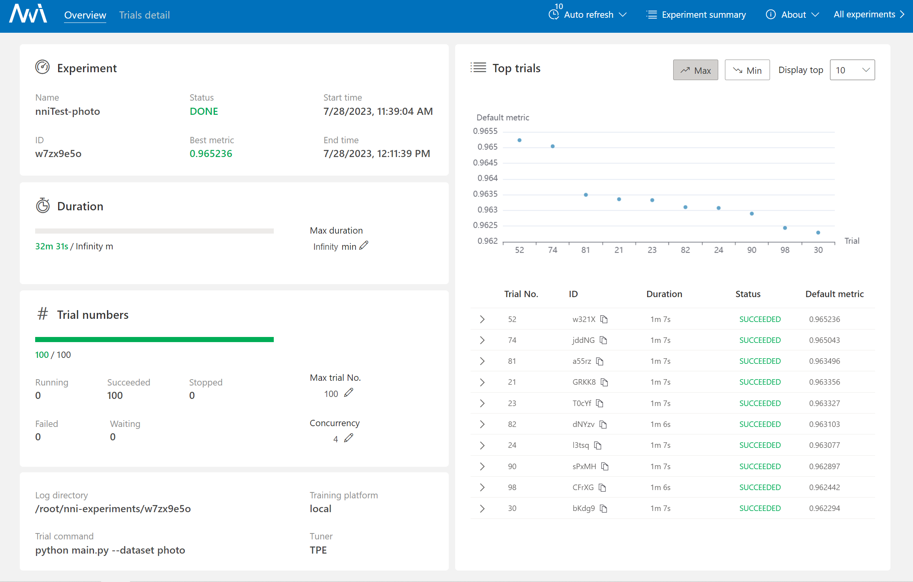
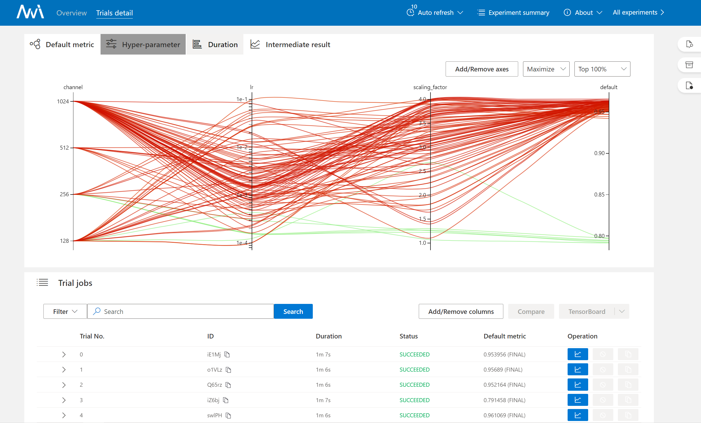

# A simple example for nni

nni是一个简单并且强大的调参框架，其中集成了较多超参数优化算法并且提供了优雅的管理界面。
```bash
pip instal nni
```



[官方文档](https://github.com/microsoft/nni)已经写得很详细了，但是阅读的顺序有些不直观。下面用一个简单的例子来辅助展示如何使用nni进行调参。
## 主要代码修改
`main.py`中展示了一个简单的link prediction任务。其中在开头定义了可相关的超参数，定义了train，test等函数，并在最后用一个for epoch循环来进行训练。

相比于一般的代码，它有以下三个不同
1. 通过`nni.get_next_parameter()`获取超参数

    一个`params` 字典在开头被创建，其中key为想要调整的超参数名字，value为超参数的默认值。
    在这之后，下面两行代码会被执行， `nni.get_next_parameter()`会返回一个字典，其中包含了优化后的超参数。
    ```python
    optimized_params = nni.get_next_parameter()
    params.update(optimized_params)
    ```
2. 通过`nni.report_intermediate_result()`报告中间结果,这个函数会在每个epoch结束后被调用，用来报告中间结果。
    ```python
    nni.report_intermediate_result(acc)
    ```
2. 通过`nni.report_final_result()`报告最终结果结果。在所有epoch 结束后，最终结果会被报告。
    ```python
    nni.report_final_result(acc)
    ```
## 配置文件编写
至此，我们已经完成了对一个简单代码的改造，接下来我们需要在`config.yaml`中定义超参数的搜索空间。更多类型和定义请看[官方文档对于搜素空间的描述](https://nni.readthedocs.io/en/stable/hpo/search_space.html)。

```yaml
search_space:
  channel:
    _type: choice
    _value: [ 128, 256, 512, 1024 ]
  lr:
    _type: loguniform
    _value: [ 0.0001, 0.1 ]
  scaling_factor:
    _type: uniform
    _value: [ 1 ,4 ]
```
在yaml中还可以指定其他设置，比如超参搜索的算法，机器上的GPU数量，训练的最长时间和最大次数，甚至远程分步式训练也是支持的。你可以查阅yaml的注释，也可以进一步详细看文档。

最后，我们可以通过以下命令来启动训练,指定端口号和配置文件。
```bash
nnictl create --config config.yaml --port 1234
```
到了这一步，你就可以在浏览器中打开`localhost:1234`来查看训练的进度了。界面就是开头的两张图。